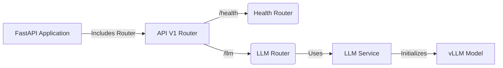
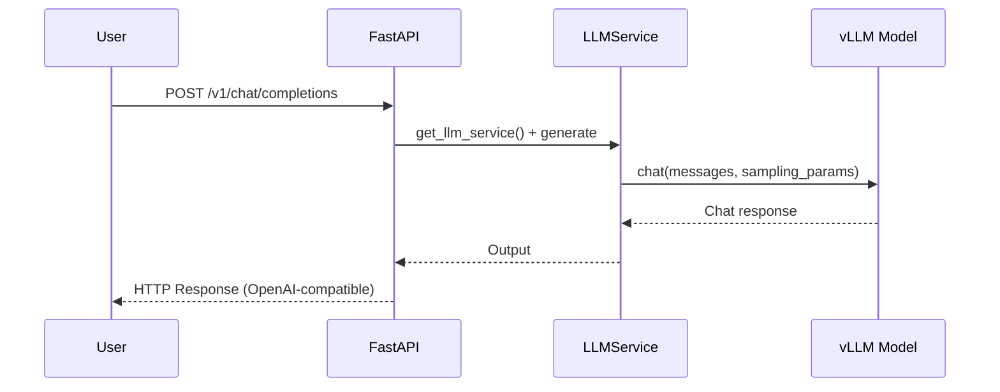

Установить VLLM по инструкции
https://t.me/simple_agi/40

# Repository Overview

This document provides a multi-perspective analysis of the repository located at `/home/nikita/PROJECTS/vllm5090`. The repository contains a FastAPI-based application that serves text completion and chat completion endpoints using vLLM. It is divided into several modules with clear responsibilities, focusing on configuration, service initialization, request handling, and routing.

---

## High-Level Architecture

Below is a Mermaid diagram showing how the major components within the project interact:

### Main Components

1. **app.py** (Root FastAPI application):
   - Defines the FastAPI app with a lifespan manager. 
   - Initializes and shuts down the `LLMService`.
   - Includes the top-level API router (`api/v1/routers.py`).

2. **routers.py**:
   - Creates an `APIRouter`.
   - Includes two routers:
     - `health_router` (in `health.py`) for health checks.
     - `llm_router` (in `llm.py`) for LLM operations.

3. **llm.py**:
   - Defines endpoints for completions (`/completions`) and chat completions (`/chat/completions`).
   - Uses Pydantic models for request validation (`CompletionRequest` and `CompletionRequestChat`).
   - Builds sampling parameters (`_build_sampling_params`) and constructs responses in an OpenAI-compatible style.

4. **health.py**:
   - Provides endpoints to verify application and model readiness.
   - Checks if the `LLMService` is initialized.

5. **services/llm_service.py**:
   - A class (`LLMService`) to manage the lifecycle of the vLLM model.
   - Handles initialization, GPU resource cleanup, and generating text from prompts or chat interactions.

6. **core/config.py** (Not fully shown but referenced):
   - Presumably loads configuration values such as default model, GPU memory utilization, parallelism, etc.

---

## Software Architecture Perspective

- **Microservice Approach**: The code shows a single FastAPI service that can be part of a microservices environment. All logic is encapsulated in well-separated Python modules.
- **Separation of Concerns**: 
  - `app.py` focuses on the application lifecycle and aggregator for routes. 
  - `routers.py` defines the overall routing structure.
  - `llm.py` and `health.py` define distinct endpoints.
  - `llm_service.py` encapsulates the model logic and resource management.
- **Scalability**: 
  - The design aims to handle multiple requests for text generation. 
  - `vLLM` is utilized for GPU-accelerated text generation, and the service can potentially be scaled via containerization.

---

## Software Developer Perspective

1. **Entry Point**: 
   - `app.py` is the main entry point. 
   - It sets up the FastAPI instance with a lifespan manager to initialize and shut down the LLM service.

2. **Endpoints**:
   - **GET /health/**: Basic “server is up” check.
   - **GET /health/model**: Checks if the LLM is initialized.
   - **POST /v1/completions**: Standard text completions.
   - **POST /v1/chat/completions**: Chat-based completions with a system and user conversation flow.

3. **How to Extend**:
   - Add new endpoints in `llm.py` if they relate to LLM operations, or create a new router file if unrelated to LLM.
   - Update the Pydantic models in `llm.py` for new request parameters.
   - Adjust or override sampling parameters in `_build_sampling_params`.

4. **Important Dependencies**:
   - **FastAPI** for the web framework.
   - **vLLM** for text generation.
   - **Ray** and **torch** for distributed computing and GPU usage.

---

## Product Manager Perspective

- **Purpose**: 
  - Provide an OpenAI-compatible interface for generating text or chat completions using local or remotely hosted vLLM models.
- **Business Value**: 
  - Allows users to integrate advanced language model completions into their applications without directly managing the complexity of large model inference. 
  - The consistent API design supports easy replacement or supplementation of OpenAI endpoints.
- **Possible Roadmap**:
  - Add advanced metrics or monitoring endpoints (for usage tracking).
  - Expand support for more language models.
  - Improve multi-model management and dynamic model switching.

---

## Additional Mermaid Diagrams

### Sequence Diagram for Chat Completion

---

## Conclusion

This repository implements a FastAPI service exposing endpoints compatible with OpenAI’s completion API. It leverages a `vLLM`-based service for text generation. The architecture ensures clear separation of responsibilities, making the project easier to maintain, scale, and extend. Developers can focus on the logic in `llm.py` and `llm_service.py` for enhancements, while the overarching application structure in `app.py` and `routers.py` remains consistent.
